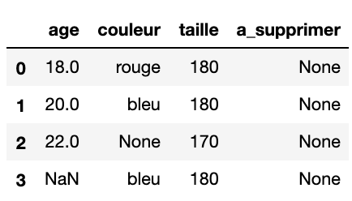
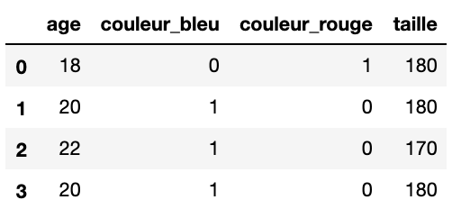

# Kata Dataframe
Il s'agit d'un petit kata mettant en pratique le TDD sur des DataFrame. Sympa en entretien tech ;).

## Instructions
Tout d'abord, checkout sur la branche qui donne un squelette vide :
```
git checkout start
```
Ensuite, le but est de créer une fonction __process__ qui prend un DataFrame en entrée et :
1. Supprime les colonnes voulues
2. Remplit les valeurs manquantes : la moyenne pour les numériques et la modalité la plus présente pour les catégories
3. Traite les catégories avec du one-hot encoding

En entrée, on peut considérer le DataFrame suivant : 


En sortie, on peut considérer le DataFrame suivant : 


## Solution
Pour voir la solution proposée : 
```
git checkout solution
```
Le fichier TIPS.md donne également des conseils.